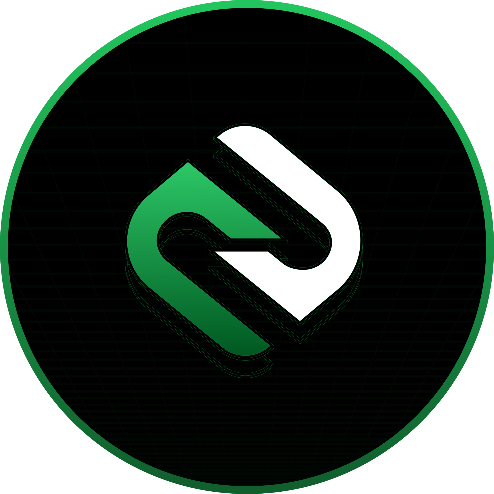

  

<h1 align="center">Zegent - Your AI-Powered Web3 Companion</h1>

  <strong>🎉 We're Going Open Source! 🎉</strong>

  
  

  We're excited to announce that Zegent is transitioning to open source! Join us in building the future of AI-powered crypto analysis.

## 🌟 Why Open Source?

We believe that the best tools for Web3 should be built in the open, by the community. Starting with our V1 extension codebase, we'll be progressively open-sourcing more components of our tools to enable community-driven development and innovation.

## 🤖 AI Agents

### 📊 Trading Analysis Agent
- Real-time technical analysis
- Buy/sell signals with confidence ratings
- Support/resistance identification
- Risk assessment and position sizing
- Pattern recognition

### 📝 Smart Contract Analysis Agent
- Automated security audits
- Vulnerability detection
- Tokenomics assessment
- Scam pattern detection
- Gas optimization analysis

### 🐦 Social Sentiment Agent
- Twitter sentiment analysis
- Community engagement metrics
- Trend detection and analysis
- Social impact scoring
- Volume/mention correlation

## 🚀 Quick Start

### Prerequisites
- Node.js ≥ 14.0.0
- Chrome browser
- Claude API key
- Etherscan API key

### Installation

1. Clone the repository:

bash
git clone https://github.com/ZegentAI/ExstensionV1.git
cd ExstensionV1

2. Install dependencies:

bash
npm install

3. Configure environment variables:

bash
cp .env.example .env
Edit .env with your API keys

4. Start the server:

bash
npm run dev

5. Load in Chrome:

- Navigate to `chrome://extensions/`
- Enable "Developer mode"
- Click "Load unpacked"
- Select the extension directory

## 💡 Usage

1. Click the Zegent extension icon in Chrome
2. Enter a token address
3. Choose your analysis agent:
   - **Trader**: Chart analysis & signals
   - **Contract**: Smart contract review
   - **Twitter**: Social sentiment analysis
4. View comprehensive analysis results

## 🛠️ Architecture

- **Frontend**: HTML, CSS (Tailwind), JavaScript
- **Backend**: Node.js, Express
- **AI Engine**: Claude 3 Sonnet
- **APIs**: 
  - Etherscan (Contract data)
  - Twitter (Social metrics)
  - Claude (Analysis)

## 📖 Documentation

- [Contributing](CONTRIBUTING.md)

## 🤝 Contributing

We welcome contributions! See our [Contributing Guidelines](CONTRIBUTING.md) for details.

1. Fork the repository
2. Create your feature branch (`git checkout -b feature/AmazingFeature`)
3. Commit your changes (`git commit -m 'Add some AmazingFeature'`)
4. Push to the branch (`git push origin feature/AmazingFeature`)
5. Open a Pull Request

## 🔒 Security

- All API keys are stored locally
- No data is collected or stored
- Analysis is performed in real-time
- Open source for transparency

## 📜 License

This project is licensed under the MIT License - see [LICENSE](LICENSE) file.

## ⚠️ Disclaimer

This tool is for educational purposes only. Cryptocurrency trading carries significant risks. Always conduct your own research and never invest more than you can afford to lose.

## 📧 Support & Community

- Report [Issues](https://github.com/ZegentAI/ExstensionV1/issues)
- Follow on [Twitter](https://twitter.com/ZegentAI)
- Visit our [Website](https://zegent.app)

## 🙏 Acknowledgments

- [Claude AI](https://anthropic.com/claude) - Powering our analysis agents
- [Etherscan](https://etherscan.io) - Blockchain data provider

---

  Made with ❤️ by the Zegent Team

